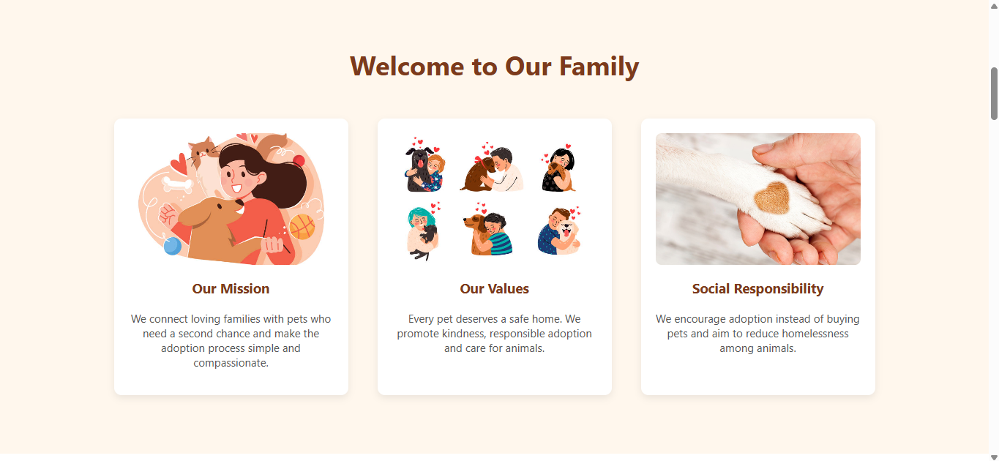

# ReHomePaws

ReHomePaws is a full-stack pet adoption and rehoming platform that connects pet owners with prospective adopters. It provides a structured space for creating pet listings, discovering suitable companions, submitting adoption applications, and communicating in real time.

---

## Overview

### What ReHomePaws Is
**ReHomePaws** is a full-stack pet rehoming and adoption platform designed to facilitate transparent, non-commercial pet adoptions between caring owners and screened adopters.

### The Problem It Solves
Traditional pet adoption often suffers from fragmented communication, lack of transparent pet histories, and informal social media listings without proper screening. ReHomePaws streamlines the adoption lifecycle by providing:
* Detailed pet profiles covering health, behavior, and care needs.
* Structured application questionnaires to evaluate adopter readiness and living environments.
* Direct real-time communication between pet owners and prospective adopters.
* An administrative moderation workflow to review and verify pet listings before publication.

### Who Can Use It
* **Pet Adopters:** Discover pets based on preferences and location, submit structured adoption applications, and coordinate directly with owners.
* **Pet Owners:** List pets with detailed care information, review incoming applications, and manage adoption handovers.
* **Platform Administrators:** Moderate incoming pet listings, manage platform users, and monitor overall adoption activity.

---

## Features

### Role-Based Portals & Access Control
* **Three Dedicated Roles:** Tailored interfaces and permissions for **Adopters**, **Pet Owners**, and **Administrators**.
* **Guarded Access:** Public catalog browsing for visitors, with full pet profiles, applications, and messaging protected for authenticated users.
* **Email Verification:** 6-digit OTP email verification for secure account registration and password resets.

### Pet Profiling & Discovery
* **Comprehensive Listings:** Tracks breed, age, size, weight, color, medical/vaccination records, training, temperament, energy level, dietary needs, and compatibility with kids, other pets, and strangers.
* **Multi-Photo Uploads:** Support for multiple photos per pet with an interactive gallery preview.
* **Multi-Parameter Search & Filtering:** Filter pets by type, breed, location/city, gender, size, and vaccination status with instant text search.
* **Saved Pets / Wishlist:** Adopters can shortlist and save favourite pets for quick access.

### Structured Adoption Workflow
* **Detailed Questionnaire:** Captures housing type, family composition, daily routine, outdoor space availability, emergency pet care backup, and motivation.
* **Status Pipeline:** Applications transition through `PENDING`, `ACCEPTED`, `REJECTED`, and `WITHDRAWN` states.
* **Automated Resolution:** Accepting an application automatically marks the pet as `ADOPTED` and notifies other pending applicants.

### Real-Time Communication & Notifications
* **Live In-App Chat:** Real-time 1-on-1 messaging between pet owners and adopters scoped to each adoption application using Socket.IO.
* **Typing Indicators & History:** Live typing status and persistent message history.
* **Real-Time In-App Notifications:** Instant alerts for application submissions, status updates, and withdrawals.

### Admin Moderation & Dashboard
* **Listing Verification Queue:** Review submitted pet listings before approving or rejecting them for public listing.
* **Platform Oversight:** Centralized management of registered users, listings, contact inquiries, and platform metrics.

---

## Screenshots

### 1. Landing & Role Selection

#### Landing Page


#### Welcome & Onboarding


#### Role Selection


---

### 2. User Registration & Onboarding

#### Adopter Registration


#### Pet Owner Registration


---

### 3. Pet Discovery & Listing

#### Pet Registration Process


#### Browse & Filter Available Pets


#### Register a Pet Listing


---

### 4. Adoption Application & Communication

#### Adoption Application Process


#### Adopter - My Submitted Applications


#### Pet Owner - Received Applications


#### Real-Time In-App Chat


---

### 5. Administration

#### Admin Moderation Dashboard


---

## Tech Stack

| Domain | Technologies |
| :--- | :--- |
| **Frontend** | React 19, Vite, React Router 7, Axios, React Icons, Socket.IO Client, Vanilla CSS |
| **Backend** | Node.js, Express.js (v5), Socket.IO, Multer, Cloudinary SDK, JWT, bcryptjs, express-rate-limit, cookie-parser |
| **Database** | MongoDB, Mongoose (v9) |
| **Email Service** | Google Apps Script Webhook (Gmail API) |

---

## Application Architecture

```text
React + Vite (Frontend SPA)
       ↓  HTTP / WebSocket (Socket.IO)
Express.js API (Backend Server)
       ↓  Mongoose ODM
    MongoDB (Atlas / Local Fallback)
       ↓
Cloudinary (Primary)  /  Local Multer Storage (Fallback)
```

### Storage & Database Fallback
* **Database Fallback:** The application connects primarily to MongoDB Atlas. If MongoDB Atlas is unavailable or unconfigured, the application falls back to a configured local MongoDB instance.
* **Storage Fallback:** When Cloudinary credentials are provided, uploaded images are hosted via Cloudinary. If credentials are not configured or the service is unreachable, Multer saves files to the local `server/uploads/` directory and serves them statically.

---

## Project Structure

```text
ReHomePaws/
├── client/                     # Frontend Application (React + Vite)
│   ├── public/                 # Static assets
│   ├── src/
│   │   ├── assets/             # Project images and illustrations
│   │   ├── components/         # UI components (Navbar, Footer, ChatPanel, Modal, Skeletons, Toast)
│   │   ├── pages/              # Route views (Home, AdoptPets, PetDetail, AddPet, EditPet, Profile, etc.)
│   │   │   └── admin/          # Admin views (AdminLogin, AdminRegister, AdminDashboard)
│   │   ├── routes/             # ProtectedRoute guards
│   │   ├── services/           # Axios API modules and Socket services
│   │   ├── styles/             # Modular CSS stylesheets
│   │   ├── utils/              # Helper utilities
│   │   ├── App.jsx             # Application layout & routing
│   │   └── main.jsx            # Entry point
│   ├── .env.example            # Frontend environment variable template
│   └── package.json
│
├── server/                     # Backend Application (Node.js + Express)
│   ├── config/                 # Database, Cloudinary, and Socket.IO configurations
│   ├── controllers/            # Request handlers (Auth, Pet, Adoption, Admin, Chat, Message, Notification)
│   ├── middleware/             # Auth guards, rate limiters, and upload handlers
│   ├── models/                 # Mongoose schemas (User, Pet, Adoption, ChatMessage, Message, Notification, Otp)
│   ├── routes/                 # API endpoint routers
│   ├── server.js               # Server entry point & Socket.IO handlers
│   ├── .env.example            # Backend environment variable template
│   └── package.json
│
├── docs/                       # Documentation assets
│   └── screenshots/            # Interface screenshots
├── .gitignore                  # Git ignore rules
└── README.md                   # Project documentation
```

---

## Getting Started

### Prerequisites
* [Node.js](https://nodejs.org/) (v18.x or higher)
* [npm](https://www.npmjs.com/) (v9.x or higher)
* [MongoDB](https://www.mongodb.com/) (local instance or MongoDB Atlas cluster)

---

### Installation

1. **Clone the repository:**
   ```bash
   git clone https://github.com/your-username/ReHomePaws.git
   cd ReHomePaws
   ```

2. **Install backend dependencies:**
   ```bash
   cd server
   npm install
   ```

3. **Install frontend dependencies:**
   ```bash
   cd ../client
   npm install
   ```

---

### Environment Variables

Both `server/` and `client/` require a `.env` file for configuration. Copy the provided `.env.example` templates to create them.

#### Backend Configuration (`server/.env`)
```bash
cd server
cp .env.example .env
```

| Variable | Description | Example / Placeholder |
| :--- | :--- | :--- |
| `PORT` | Server listening port | `8080` |
| `MONGODB_URI` | MongoDB Atlas connection string | `mongodb+srv://<username>:<password>@<cluster-url>/rehomepaws` |
| `LOCAL_MONGODB_URI` | Local fallback MongoDB URI | `mongodb://localhost:27017/rehomepaws` |
| `JWT_SECRET` | Secret key for signing JWT tokens | `<your-jwt-secret>` |
| `ADMIN_SECRET` | Secret key required to register admin accounts | `<your-admin-secret>` |
| `FRONTEND_URL` | Frontend origin for CORS configuration | `http://localhost:5173` |
| `GOOGLE_SCRIPT_URL` | Google Apps Script URL for sending OTP emails | `https://script.google.com/macros/s/<script-id>/exec` |
| `CLOUDINARY_CLOUD_NAME` | Cloudinary cloud name | `<your-cloud-name>` |
| `CLOUDINARY_API_KEY` | Cloudinary API key | `<your-api-key>` |
| `CLOUDINARY_API_SECRET` | Cloudinary API secret | `<your-api-secret>` |
| `UPLOADS_DIR` | Local uploads directory name | `uploads` |

#### Frontend Configuration (`client/.env`)
```bash
cd client
cp .env.example .env
```

| Variable | Description | Example / Default |
| :--- | :--- | :--- |
| `VITE_API_URL` | Backend API base URL | `http://localhost:8080/api` |

---

### Running the Application

1. **Start the backend server:**
   ```bash
   cd server
   npm run dev
   ```
   *Runs on `http://localhost:8080`.*

2. **Start the frontend application:**
   ```bash
   cd client
   npm run dev
   ```
   *Runs on `http://localhost:5173`.*

---

## Database & Image Storage

* **MongoDB Atlas & Local Fallback:** The primary connection uses MongoDB Atlas. If Atlas is unavailable or unconfigured, the server automatically connects to the local database defined in `LOCAL_MONGODB_URI`.
* **Cloudinary & Local Multer Storage:** Uploaded pet images are processed via Multer. When Cloudinary credentials are provided, images are stored in Cloudinary; otherwise, files are saved locally to `server/uploads/` and served via static route.

---

## Authentication & Security

* **Password Hashing:** Passwords are salted and hashed using `bcryptjs` before storage.
* **JWT Session Handling:** Authenticated sessions use `HttpOnly`, `SameSite` signed cookies (`token` for adopters/owners and `adminToken` for administrators).
* **OTP Email Verification:** Account registrations and password resets issue a 6-digit numeric code stored with an automated TTL expiry in MongoDB.
* **Rate Limiting:** Protection against brute-force attempts on authentication and OTP routes via `express-rate-limit`.
* **Input Validation:** Strict validation across all controller endpoints to ensure data integrity.

---

## API Overview

### Authentication (`/api/auth`)
| Method | Endpoint | Description | Access |
| :--- | :--- | :--- | :--- |
| `POST` | `/api/auth/register` | Send OTP and initiate user registration | Public |
| `POST` | `/api/auth/verify-otp` | Verify OTP and create user account | Public |
| `POST` | `/api/auth/login` | Authenticate user and issue JWT cookie | Public |
| `POST` | `/api/auth/logout` | Invalidate and clear auth cookies | Authenticated |
| `GET` | `/api/auth/me` | Retrieve authenticated user profile | Authenticated |
| `PUT` | `/api/auth/me` | Update user profile information | Authenticated |

### Pet Management (`/api/pets`)
| Method | Endpoint | Description | Access |
| :--- | :--- | :--- | :--- |
| `GET` | `/api/pets/available` | Get all verified available pets | Public |
| `GET` | `/api/pets/:id` | Get full pet profile and owner information | Adopter / Owner |
| `POST` | `/api/pets/add` | Submit pet listing for admin verification | Owner / Admin |
| `GET` | `/api/pets/my` | Retrieve pets listed by the current owner | Owner / Admin |
| `PUT` | `/api/pets/:id` | Update pet details or photos | Owner / Admin |
| `DELETE` | `/api/pets/:id` | Delete pet listing and close applications | Owner / Admin |

### Adoptions (`/api/adoptions`)
| Method | Endpoint | Description | Access |
| :--- | :--- | :--- | :--- |
| `POST` | `/api/adoptions` | Submit adoption application questionnaire | Adopter |
| `GET` | `/api/adoptions/my` | Retrieve applications submitted by adopter | Adopter |
| `GET` | `/api/adoptions/owner` | Retrieve applications received for owner's pets | Owner |
| `PUT` | `/api/adoptions/:id/accept` | Accept application and mark pet adopted | Owner / Admin |
| `PUT` | `/api/adoptions/:id/reject` | Reject application | Owner / Admin |
| `PUT` | `/api/adoptions/:id/cancel` | Withdraw pending application | Adopter / Admin |

### Administration (`/api/admin`)
| Method | Endpoint | Description | Access |
| :--- | :--- | :--- | :--- |
| `GET` | `/api/admin/stats` | Retrieve platform-wide metrics and counts | Admin |
| `GET` | `/api/admin/pets/pending` | Retrieve pet listings awaiting approval | Admin |
| `PUT` | `/api/admin/pets/:id/approve` | Approve listing for public display | Admin |
| `PUT` | `/api/admin/pets/:id/reject` | Reject submitted listing | Admin |
| `GET` | `/api/admin/users` | List all registered adopters and owners | Admin |
| `DELETE` | `/api/admin/users/:id` | Remove user account | Admin |

### Chat & Notifications (`/api/chat`, `/api/notifications`)
| Method | Endpoint | Description | Access |
| :--- | :--- | :--- | :--- |
| `GET` | `/api/chat/:adoptionId` | Fetch message history for an adoption | Application Parties / Admin |
| `GET` | `/api/notifications` | Fetch user notifications | Authenticated |
| `PUT` | `/api/notifications/read` | Mark all user notifications as read | Authenticated |

---

## Future Enhancements

* **AI-Based Pet Recommendations:** Recommend suitable pets based on an adopter's preferences, interests, and previous interactions.
* **Veterinary & Health Records:** Allow pet owners to maintain vaccination, medical, and health records for their pets.
* **Adoption Eligibility Assessment:** Introduce a structured assessment to help evaluate whether an adopter is suitable for a particular pet.
* **Shelter & NGO Integration:** Allow animal shelters and NGOs to register and list pets available for adoption.
* **Adoption Verification Workflow:** Add a more comprehensive verification process for adoption applications, including document verification and approval stages.

---
